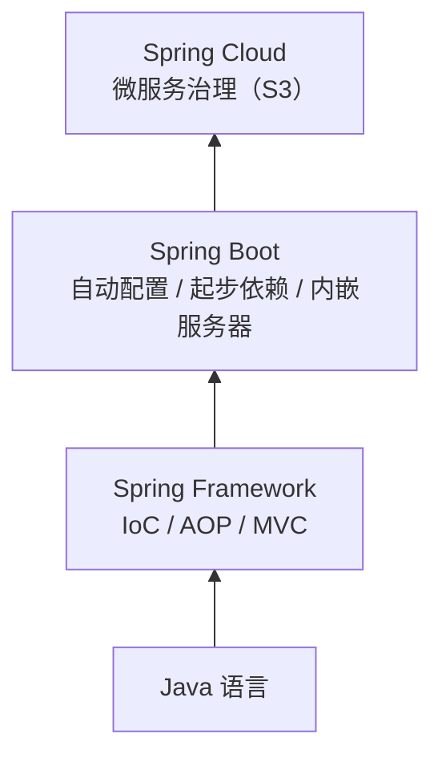

# Day 1 · 后端入门 Q&A 复习笔记（环境四件套 + Java/Spring Boot）

> 阶段：S0 环境搭建（对应学习计划第 1 周）→ S1 前置认知
> 用法：先盖住答案自测，再对照检查；能用「自己的话」讲出来才算过关。
> 内容：① JDK · ② IntelliJ IDEA · ③ Maven · ④ Docker Desktop · ⑤ Java 与 Spring Boot 的关系

---

## Q1：JDK 是什么？

**答：JDK（Java Development Kit，Java 开发工具包）是「写 Java、编译 Java、运行 Java」所需的一整套工具集合。**

它包含三部分：

1. **开发工具**：`javac`（编译器）、`jar`（打包）、`javadoc`（文档生成）、`jdb`（调试器）、`jshell`（交互式 REPL）
2. **运行环境（JRE）**：运行已编译 Java 程序所需的环境
3. **核心类库**：Java 标准库（集合、IO、网络、并发等）

> 关键点：**没有 JDK，连 `.java` 源码都编译不了。**

### 前端视角类比

| Java 世界 | 前端类比 | 说明 |
|---|---|---|
| JDK | Node.js 全家桶 | 运行时 + 工具链打包在一起 |
| `javac`（编译器） | `tsc`（TypeScript 编译器） | 把源码编译成可执行产物 |
| JVM | V8 引擎 | 真正执行代码的「发动机」 |
| `.java` 源码 | `.ts` 源码 | 开发时写的源文件 |
| `.class` 字节码 | 编译后的 `.js` | 编译产物 |
| `jshell` | Node REPL | 交互式快速试验 |
| `java -jar xxx.jar` | `node app.js` | 启动一个应用 |

---

## Q2：JDK、JRE、JVM 三者的关系？

**答：包含关系 —— JDK ⊃ JRE ⊃ JVM。**

| 名称 | 全称 | 职责 | 一句话 |
|---|---|---|---|
| JVM | Java Virtual Machine | 加载并执行字节码，屏蔽操作系统差异 | 「发动机」 |
| JRE | Java Runtime Environment | JVM + 核心类库，只够**运行**程序 | 「能开车，不能造车」 |
| JDK | Java Development Kit | JRE + 开发工具，能**开发 + 运行** | 「整车 + 造车工具」 |

> 补充：JDK 9 模块化之后，官方不再单独分发 JRE 安装包，但概念上仍是 JDK ⊃ JRE ⊃ JVM。

---

## Q3：一段 Java 代码是怎么跑起来的？

**答：**

```
Hello.java  --javac 编译-->  Hello.class（字节码）  --java 命令 / JVM-->  运行结果
```

1. 写代码：`Hello.java`
2. 编译：`javac Hello.java` → 生成 `Hello.class`
3. 运行：`java Hello` → JVM 加载并执行字节码

**跨平台原理**：字节码是中间语言，各操作系统安装各自的 JVM 即可 —— **「一次编译，到处运行」**。
（对比前端：靠各浏览器引擎解释执行 JS；Java 则是先用统一的字节码换取了平台无关性。）

---

## Q4：为什么前端转后端，第一步是装 JDK？

**答：**

1. 后端服务（Spring Boot）用 Java 编写，**编译和运行都必须有 JDK**。
2. Maven / Gradle、IntelliJ IDEA 等工具都通过 `JAVA_HOME` 环境变量**定位 JDK**。
3. 本学习计划 S0 指定 **JDK 17**：Spring Boot 3 的最低要求就是 JDK 17。

---

## Q5：装哪个版本、选哪个发行版？

**答：**

- **版本**：选 **LTS（长期支持版）**。目前 LTS 有 8 / 11 / 17 / 21 / 25，本计划统一用 **JDK 17**（够用、生态最稳）。
- **发行版（都是基于 OpenJDK 的构建，用法基本无差别）**：
  - Eclipse Temurin（Adoptium）—— 社区主流，推荐
  - Amazon Corretto —— AWS 维护
  - Microsoft Build of OpenJDK
  - Oracle JDK —— 原厂，注意商业许可条款
  - Alibaba Dragonwell —— 阿里维护，国内生态友好

---

## Q6：怎么验证安装成功？

**答：** 打开终端执行：

```powershell
java -version      # 查看运行时版本
javac -version     # 查看编译器版本
$env:JAVA_HOME     # PowerShell 查看 JAVA_HOME
```

过关标准：

- 两条命令都能输出，且版本为 **17.x**
- `java -version` 与 `javac -version` **版本一致**（不一致说明 PATH 或 JAVA_HOME 配置有问题）

---

## Q7：JAVA_HOME 是干什么的？

**答：** 一个指向「JDK 安装根目录」的环境变量。

- Maven、Gradle、IDEA 等工具靠它找到 JDK
- 通常还会把 `%JAVA_HOME%\bin` 加进 `PATH`，让 `java`、`javac` 命令在任意目录可用

---

## Q8：快问快答自测（先盖住上文作答）

1. JDK 和 JRE 谁包含谁？
2. 只装 JRE 能写 Java 程序吗？能运行吗？
3. `javac` 和 `java` 两条命令分别做什么？
4. 为什么 Java 能跨平台？靠的是什么？
5. 为什么 Maven / IDEA 都要求配置 `JAVA_HOME`？
6. `.java` 和 `.class` 分别对应前端的什么？

---

## 一句话总结

> JDK = 开发工具 + JRE + 核心类库；`javac` 把 `.java` 编译成 `.class`，JVM 负责执行 `.class`。
> **Day 1 完成标准：JDK 17 安装成功，`java -version` 与 `javac -version` 输出一致。**

---

---

# IntelliJ IDEA 是什么？（Q&A 复习笔记）

> 阶段：S0 环境搭建 · 工具链第 2 件（前有 JDK，后有 Maven）
> 用法：先盖住答案自测，再对照检查；能用「自己的话」讲出来才算过关。

---

## Q1：IntelliJ IDEA 是什么？

**答：IntelliJ IDEA 是 JetBrains 公司出品的 Java 集成开发环境（IDE），是 Java 生态最主流的开发工具。**

- **IDE** = Integrated Development Environment（集成开发环境）：把「写代码 → 编译 → 运行 → 调试 → 版本控制」集成到一个软件里
- **名字记忆钩**：IntelliJ ≈ Intelligent Java；IDEA = 集成开发环境
- **地位**：Spring 官方教程默认用它演示，是 Java 开发的事实标准工具

### 前端视角类比

| Java 世界 | 前端类比 |
|---|---|
| IntelliJ IDEA | WebStorm（JetBrains 家的前端 IDE）/ VS Code |
| IDE「一站式集成」 | VS Code「轻量编辑器 + 插件」拼装模式 |
| IDEA 与 WebStorm 操作逻辑相近 | 同属 JetBrains 产品线，界面 / 快捷键风格几乎一致 |

---

## Q2：IDEA 和 VS Code 有什么区别？前端转 Java 该选哪个？

**答：定位不同 —— VS Code 是「轻量编辑器 + 插件」，IDEA 是「开箱即用的完整 IDE」。**

| 维度 | VS Code | IntelliJ IDEA |
|---|---|---|
| 定位 | 轻量编辑器，能力靠插件拼装 | 重型完整 IDE，能力内置 |
| 资源占用 | 小 | 大 |
| Java 支持 | 需装插件（Extension Pack for Java） | 原生深度支持：代码分析、重构、调试 |
| Spring 支持 | 依赖插件 | 内置深度支持（旗舰版） |
| 前端开发 | 极强 | 不如 VS Code，前端项目继续留在 VS Code |

**结论：学 Java / Spring Boot 用 IDEA，前端项目继续用 VS Code，两个一起开，各管一摊。**

---

## Q3：社区版（Community）和旗舰版（Ultimate）怎么选？

**答：**

| 版本 | 价格 | 能力 | 适合阶段 |
|---|---|---|---|
| Community（社区版） | 免费 | Java / Kotlin 基础开发、Maven、Git、调试器 | S1 学 Java 基础足够 |
| Ultimate（旗舰版） | 付费 | 增加 Spring / Spring Boot 深度支持、数据库工具、HTTP Client、Profiling | Spring Boot 阶段体验显著更好 |

- 学生 / 教师可申请**免费教育许可**；JetBrains 的政策会不时调整，安装前查一下官网最新优惠
- 建议：**先用社区版起步**，学到 Spring Boot 阶段再升级 —— 工具只是辅助，别卡在选择上

---

## Q4：IDEA 界面里最该先掌握的 5 个区域？

**答：**

1. **Project 视图（左）**：项目文件树（对应 VS Code 的资源管理器）
2. **编辑器（中）**：红色波浪线 = 报错，黄色 = 警告；`Alt + Enter` 快速修复
3. **Run / Debug 面板（下）**：运行输出、断点调试（查看变量、单步执行）
4. **右侧工具窗口**：Maven 面板（依赖 / 生命周期）、Git 面板、Database（旗舰版）
5. **Search Everywhere（双击 `Shift`）**：找类、文件、动作、设置 —— 整个 IDE 的入口

---

## Q5：常用快捷键（Windows 默认键位，先记 10 个）

**答：**

| 快捷键 | 作用 |
|---|---|
| `Shift + Shift` | Search Everywhere：找一切 |
| `Ctrl + Shift + F10` | 运行当前文件（跑 Hello World 就靠它） |
| `Shift + F10` / `Shift + F9` | 运行 / 调试上次的配置 |
| `Alt + Enter` | 快速修复 / 意图操作（写代码最常用） |
| `Ctrl + B`（或 Ctrl + 左键） | 跳转到定义 |
| `Ctrl + Alt + L` | 格式化代码 |
| `Ctrl + /` | 注释 / 取消注释 |
| `Alt + Insert` | 生成代码（构造器、getter/setter、toString） |
| `Ctrl + D` | 复制当前行 |
| `F8` / `F7` / `F9`（调试中） | 单步 / 步入 / 继续执行 |

---

## Q6：IDEA 怎么找到我装的 JDK？（衔接昨日笔记）

**答：** 在项目设置里手动指向 JDK 17 安装目录：

- **Project SDK**：File → Project Structure（`Ctrl + Alt + Shift + S`）→ SDK 选 JDK 17
- **Maven 用的 JDK**：Settings → Build Tools → Maven → Runner → JRE 选 JDK 17
- **前端类比**：类似 VS Code 里为项目选择 Node 解释器（`nvm use` 切版本）
- **验证**：直接运行 Hello World 成功，即环境打通

---

## Q7：S0 任务里，IDEA 要完成什么？

**答：**

1. 新建第一个 Java 项目，跑通 `main` 方法 Hello World
2. 新建 / 导入 **Spring Boot 项目**（旗舰版内置 Spring Initializr 向导；社区版可去 start.spring.io 生成后导入，效果一样）
3. 在 IDEA 中启动服务，用 curl 或浏览器访问 **`GET /api/health`** —— 即 S0 验收标准

---

## Q8：快问快答自测（先盖住上文作答）

1. IDE 全称是什么？IDEA 与 VS Code 的定位差异？
2. 社区版和旗舰版的核心区别？你现在该用哪个？
3. `Shift + Shift`、`Alt + Enter`、`Ctrl + Shift + F10` 分别做什么？
4. IDEA 在哪里配置 JDK？Maven 的 JDK 又在哪里配？
5. 前端项目要不要搬进 IDEA？（答不出就回看 Q2）

---

## 一句话总结

> IntelliJ IDEA 是 JetBrains 出品的 Java 集成开发环境：编码、运行、调试、依赖、Git 一站式集成。
> **本阶段动作：装好 IDEA（社区版即可起步）→ 指向 JDK 17 → 新建 Spring Boot 项目 → 跑通 `/api/health`。**
> 🔜 下一件工具：Maven（Java 构建工具，负责依赖管理与打包）。

---

# Maven 是什么？怎么安装配置？（Q&A 复习笔记）

> 阶段：S0 环境搭建 · 工具链第 3 件（JDK → IDEA → Maven，集齐）
> 用法：先盖住答案自测，再对照检查；能用「自己的话」讲出来才算过关。

---

## Q1：Maven 是什么？

**答：Apache Maven 是 Java 项目的「构建工具 + 依赖管理工具」，解决三件事：**

1. **依赖管理**：声明要用哪些第三方库，Maven 自动下载并管理（包括「依赖的依赖」）
2. **构建流程**：按标准生命周期完成 编译 → 测试 → 打包 → 安装 / 发布
3. **项目标准化**：统一目录结构（约定优于配置），`src/main/java` 放主代码、`src/test/java` 放测试

**一句话**：Maven ≈ 前端的「npm + 构建脚本」的结合体。

### 前端视角类比

| Maven 世界 | 前端类比 | 说明 |
|---|---|---|
| `pom.xml` | `package.json` | 项目描述文件：依赖 + 构建配置 |
| GAV 坐标（groupId:artifactId:version） | 包名 @ 版本号 | 唯一标识一个构件 |
| Maven 中央仓库 | npm registry | 公共仓库 |
| 本地仓库 `~/.m2/repository` | npm / pnpm 本地缓存 | 下载过的构件存这里 |
| `settings.xml` 配镜像 | `.npmrc` 配 registry | 换源加速 |
| `mvn package` | `npm run build` | 构建产物 |
| `mvn test` | `npm test` | 跑测试 |
| `mvnw`（Maven Wrapper） | corepack 锁定包管理器版本 | 保证团队构建版本一致 |
| 多模块 `<modules>` | monorepo workspaces | 一个仓库多模块统一构建 |

---

## Q2：为什么 Java 需要 Maven？（不用行不行）

**答：可以不用，但会很痛苦。**

- Node 生态自带 npm 解决依赖；**Java 本身没有内置依赖管理**，手动下载 jar、配置 classpath 极其繁琐
- 团队协作需要统一的目录结构、统一的构建命令、可复现的构建结果 —— 这正是 Maven 的价值
- 现在说「学 Java 后端」，标配就是 **Maven（或 Gradle）+ IDEA + Spring Boot**

---

## Q3：pom.xml 和 GAV 坐标是什么？

**答：pom.xml（POM = Project Object Model）是 Maven 项目的核心描述文件；GAV 坐标用来唯一标识每一个构件。**

- **GAV**：`groupId`（组织 / 公司）+ `artifactId`（项目 / 模块名）+ `version`（版本号）
- 声明依赖 = 写 GAV；Maven 根据 GAV 到仓库中查找构件

```xml
<project>
  <modelVersion>4.0.0</modelVersion>

  <!-- 本项目自己的坐标 -->
  <groupId>com.example</groupId>
  <artifactId>health-agent-lab</artifactId>
  <version>0.0.1-SNAPSHOT</version>

  <parent>
    <groupId>org.springframework.boot</groupId>
    <artifactId>spring-boot-starter-parent</artifactId>
    <version>3.x.x</version>
  </parent>

  <dependencies>
    <!-- 由 parent 统一管理版本，所以可以不写 version -->
    <dependency>
      <groupId>org.springframework.boot</groupId>
      <artifactId>spring-boot-starter-web</artifactId>
    </dependency>
  </dependencies>
</project>
```

- **传递依赖**：声明 A，Maven 会自动把 A 依赖的 B、C 也拉下来
- **parent / dependencyManagement**：Spring Boot 父 POM 统一管理常用依赖的版本，所以很多依赖不用自己写 `version`

---

## Q4：仓库（Repository）是怎么回事？

**答：Maven 找构件有三个地方，按「本地 → 远程」顺序查：**

| 仓库 | 位置 | 说明 |
|---|---|---|
| 本地仓库 | `C:\Users\<你>\.m2\repository` | 第一次下载后缓存在这，优先使用 |
| 中央仓库 | repo.maven.apache.org | 官方公共仓库，默认远程源 |
| 镜像 / 私服 | 如阿里云、公司 Nexus | 加速下载或内部管控，通过 settings.xml 配置 |

- 构建过程：先查本地仓库 → 没有就去远程下载（走镜像）→ 存入本地仓库
- **首次构建慢**就是这个原因；国内不配镜像经常下载缓慢甚至失败

---

## Q5：生命周期与常用命令有哪些？

**答：Maven 用「生命周期 + 阶段」定义构建流程，执行后一阶段会自动先执行前面的阶段。**

- 常用阶段：`compile`（编译）→ `test`（测试）→ `package`（打包）→ `install`（装入本地仓库）→ `deploy`（发布到远程仓库）
- `package` vs `install`：package 只把产物放到 `target/`；install 还会把产物装进**本地仓库**，供其他本地项目依赖

| 命令 | 作用 | 前端类比 |
|---|---|---|
| `mvn -v` | 查看 Maven 版本与 JDK | `node -v` / `npm -v` |
| `mvn clean` | 清理 `target/` 目录 | `rm -rf dist` |
| `mvn compile` | 编译源码 | `tsc` |
| `mvn test` | 跑单元测试 | `npm test` |
| `mvn package` | 打包（jar / war 到 `target/`） | `npm run build` |
| `mvn package -DskipTests` | 打包但跳过测试 | — |
| `mvn install` | 打包 + 装进本地仓库 | ≈ `npm link`（供其他项目复用） |
| `mvn dependency:tree` | 查看依赖树（排查冲突神器） | `npm ls` |
| `mvn spring-boot:run` | 启动 Spring Boot 应用 | `npm run dev` |

---

## Q6：怎么安装 Maven？（Windows 分步）

**答：前提是 JDK 17 已装好（昨天已完成）。**

1. **下载**：打开 [maven.apache.org/download.cgi](https://maven.apache.org/download.cgi)，下载 **Binary zip archive**（如 `apache-maven-3.9.x-bin.zip`）
2. **解压**到无空格、无中文的目录，例如 `C:\devtools\apache-maven-3.9.x`
3. **配置环境变量**（两种方式二选一）：
   - 图形界面：系统属性 → 环境变量 → 新建 `MAVEN_HOME` 指向解压目录 → 编辑 `Path` 追加 `%MAVEN_HOME%\bin`
   - PowerShell（用户级，无需管理员）：
     ```powershell
     [Environment]::SetEnvironmentVariable("MAVEN_HOME", "C:\devtools\apache-maven-3.9.x", "User")
     $userPath = [Environment]::GetEnvironmentVariable("Path", "User")
     [Environment]::SetEnvironmentVariable("Path", "$userPath;C:\devtools\apache-maven-3.9.x\bin", "User")
     ```
4. **重开终端**（让环境变量生效），验证：

```powershell
mvn -v
```

期待输出（关键三行）：

```
Apache Maven 3.9.x
Maven home: C:\devtools\apache-maven-3.9.x
Java version: 17.0.x, vendor: ...
```

- **过关标准**：`Maven home` 指向你的安装目录；`Java version` 为 17（若不对，回看 JDK 笔记的 `JAVA_HOME` 配置）

> 提示：IDEA 自带一个 Maven（Bundled），先跑通也行；但建议自己装一个，终端和 IDE 用同一套，版本可控。

---

## Q7：怎么配置？（镜像加速 + IDEA 集成）

**答：**

**① 配置阿里云镜像（国内强烈建议）**

在用户目录创建 `C:\Users\<你>\.m2\settings.xml`（`.m2` 文件夹不存在就新建）：

```xml
<?xml version="1.0" encoding="UTF-8"?>
<settings xmlns="http://maven.apache.org/SETTINGS/1.0.0">
  <mirrors>
    <mirror>
      <id>aliyunmaven</id>
      <mirrorOf>central</mirrorOf>
      <name>阿里云公共仓库</name>
      <url>https://maven.aliyun.com/repository/public</url>
    </mirror>
  </mirrors>
</settings>
```

- settings.xml 有两个位置：用户级 `~/.m2/settings.xml`（推荐，只影响自己）；全局 `MAVEN_HOME\conf\settings.xml`（影响机器上所有用户）
- 前端类比：等同于给 npm 配 `.npmrc` 换源

**② IDEA 集成**

Settings（`Ctrl + Alt + S`）→ Build, Execution, Deployment → Build Tools → Maven：

- **Maven home path**：指向自己安装的目录（不用 Bundled）
- **User settings file**：勾选 Override，指向 `C:\Users\<你>\.m2\settings.xml`
- **Local repository**：默认 `~/.m2/repository` 即可

**③ 补充：Maven Wrapper（mvnw）**

- Spring Boot 项目自带 `mvnw` / `mvnw.cmd`：本机不装 Maven 也能构建（首次自动下载指定版本）
- 团队项目建议优先用 `.\mvnw.cmd` 构建，保证大家版本一致

---

## Q8：常见疑问 + 快问快答自测

**常见疑问**

| 疑问 | 解答 |
|---|---|
| 首次构建特别慢？ | 正常，在下载依赖；配好镜像后会快很多 |
| 依赖冲突（同一个库出现多个版本）？ | `mvn dependency:tree` 定位冲突 → `<exclusions>` 排除（S1 第 5 周深入） |
| 为什么很多依赖不写 version？ | Spring Boot parent POM 的 `dependencyManagement` 统一管理了版本 |
| Maven 和 Gradle 选哪个？ | 本计划用 Maven（生态稳、资料多）；Gradle 是同类替代，遇到再学 |

**快问快答（先盖住上文作答）**

1. Maven 解决哪三件事？
2. `pom.xml` 对应前端的什么文件？GAV 分别代表什么？
3. 本地仓库 / 中央仓库 / 镜像是什么关系？
4. `mvn package` 和 `mvn install` 的区别？
5. `mvn -v` 输出中要重点检查哪两行？
6. 镜像配在哪个文件？用户级和全局级分别在什么位置？
7. IDEA 里要把 Maven 的哪三处配置分别指向哪里？

---

## 一句话总结

> Maven = Java 的「npm + 构建脚本」：用 `pom.xml` 声明依赖，自动下载管理，按生命周期标准构建。
> **工具链三件套集齐：JDK + IDEA + Maven 🎉**
> 🔜 下一件工具：Docker Desktop（用容器跑起 MySQL / Redis，本地不装数据库）。

---

# Docker Desktop 是什么？怎么跑起 MySQL / Redis 容器？（Q&A 复习笔记）

> 阶段：S0 环境搭建 · 第 4 件（本地不装数据库，用容器跑中间件）
> 用法：先盖住答案自测，再对照检查；能用「自己的话」讲出来才算过关。

---

## Q1：Docker 是什么？Docker Desktop 又是什么？

**答：**

- **Docker** 是容器化平台：把「应用 + 运行环境（依赖、配置）」打包成**镜像（Image）**，在任何机器上以**容器（Container）**方式运行 —— 根治「在我电脑上能跑」的环境不一致问题。
- **Docker Desktop** 是 Docker 官方的桌面软件（Windows / macOS）：包含容器引擎 + 命令行（CLI）+ 图形管理界面。Windows 上它借助 **WSL 2**（Linux 子系统）来运行 Linux 容器。

### 前端视角类比

| Docker 概念 | 前端类比 | 说明 |
|---|---|---|
| 镜像（Image） | npm 包 / 构建产物 | 只读模板：从仓库下载，或自己构建 |
| 容器（Container） | 运行中的实例（进程） | 由镜像启动，可启停、可删除 |
| Docker Hub | npm registry | 公共镜像仓库，`docker pull` 从这里下载 |
| Dockerfile | 构建脚本 | 描述镜像怎么构建（S3 再深入） |
| 镜像 → 容器 | 类 → 对象 | 一个镜像可以跑出多个容器 |

---

## Q2：为什么后端开发要用 Docker？（对我们项目）

**答：**

1. **本地不装数据库**：MySQL、Redis（后续还有 ES、Nacos）都用容器跑 —— 不用手动安装、不污染系统、删掉即干净
2. **一条命令起环境**：`docker run` 拉起，端口映射到本机，代码照常连 `localhost:3306`
3. **环境一致**：团队成员用同样的镜像和命令得到完全一样的环境；将来部署也用容器，开发 = 生产

---

## Q3：怎么安装 Docker Desktop？（Windows）

**答：**

1. **前提**：Windows 10/11 64 位；建议先安装 / 更新 WSL 2：
   ```powershell
   wsl --install     # 未装过 WSL 时执行
   wsl --update      # 已装过则更新
   ```
2. **下载**：打开 [docker.com/products/docker-desktop](https://www.docker.com/products/docker-desktop/)，下载 **Docker Desktop for Windows**
3. **安装**：双击安装（安装器如提示勾选 “Use WSL 2” 则保持勾选）；安装完成后**重启电脑**
4. **首次启动**：接受协议 → 可跳过登录直接使用
5. **验证**：
   ```powershell
   docker -v                # 输出 Docker version 即成功
   docker compose version   # 输出 Docker Compose version 即成功
   docker run hello-world   # 拉取并运行测试镜像，看到 "Hello from Docker!" 即成功
   ```

- 若启动报错 / 一直转圈：先 `wsl --update`；检查 BIOS 虚拟化（VT-x / AMD-V）是否开启；重启电脑
- 拉取镜像慢：Settings → Docker Engine → 配置 `registry-mirrors` 加速（国内公共加速源时效性变化快，用前搜索最新可用地址；阿里云个人加速器需登录获取专属地址）

---

## Q4：怎么跑起 MySQL 容器？

**答：** 一条 `docker run`（复制即用）：

```powershell
docker run -d --name mysql8 -p 3306:3306 -e MYSQL_ROOT_PASSWORD=123456 -e MYSQL_DATABASE=health_agent -v mysql-data:/var/lib/mysql mysql:8
```

参数逐个拆解：

| 参数 | 含义 |
|---|---|
| `-d` | 后台运行（不占用当前终端） |
| `--name mysql8` | 给容器起名 `mysql8`（后续都用名字操作它） |
| `-p 3306:3306` | 端口映射「宿主机端口 : 容器端口」，代码里连 `localhost:3306` 即可 |
| `-e MYSQL_ROOT_PASSWORD=...` | 环境变量：初始化 root 密码（必填） |
| `-e MYSQL_DATABASE=health_agent` | 环境变量：初始化时顺便建库（可选） |
| `-v mysql-data:/var/lib/mysql` | 数据卷：数据存到卷里，**容器删了数据还在** |
| `mysql:8` | 镜像名 : 标签（版本） |

**验证**：

```powershell
docker ps                                       # 能看到 mysql8 在运行（STATUS: Up）
docker exec -it mysql8 mysql -uroot -p123456    # 进入 MySQL 命令行
# mysql> SHOW DATABASES;   看到 health_agent 即成功
```

**连接信息**：地址 `localhost`、端口 `3306`、用户 `root`、密码 `123456`（IDEA 的 Database 面板 / DBeaver 等工具同理）

---

## Q5：怎么跑起 Redis 容器？

**答：** 同样一条命令：

```powershell
docker run -d --name redis7 -p 6379:6379 redis:7
```

如需密码（更接近真实环境）：

```powershell
docker run -d --name redis7 -p 6379:6379 redis:7 redis-server --requirepass 123456
```

**验证**：

```powershell
docker exec -it redis7 redis-cli               # 无密码版
# 127.0.0.1:6379> ping
# PONG                                         ← 看到 PONG 即成功

docker exec -it redis7 redis-cli -a 123456 ping   # 有密码版（输出 PONG）
```

---

## Q6：常用 Docker 命令速查表

**答：**

| 命令 | 作用 |
|---|---|
| `docker ps` | 查看运行中的容器（加 `-a` 查看全部含已停止） |
| `docker images` | 查看本地镜像 |
| `docker stop / start / restart <名>` | 停止 / 启动 / 重启容器 |
| `docker rm <名>` | 删除容器（加 `-f` 强制） |
| `docker rmi <镜像>` | 删除镜像 |
| `docker logs -f <名>` | 查看 / 跟踪容器日志 |
| `docker exec -it <名> bash` | 进入容器内部（交互式） |
| `docker pull <镜像>` | 拉取镜像 |
| `docker compose up -d` / `down` | 按配置文件一键启动 / 停止一组服务 |
| `docker system df` | 查看磁盘占用（清理用 `docker system prune`） |

---

## Q7：Docker Compose 是什么？为什么后面会用到？

**答：把「一组容器」写进一个 YAML 文件，一条命令全部拉起。**

项目后面要同时跑 MySQL、Redis、ES、Nacos 等，逐个 `docker run` 太麻烦 —— Compose 用一个文件描述清楚：

```yaml
services:
  mysql:
    image: mysql:8
    container_name: mysql8
    ports:
      - "3306:3306"
    environment:
      MYSQL_ROOT_PASSWORD: 123456
      MYSQL_DATABASE: health_agent
    volumes:
      - mysql-data:/var/lib/mysql
  redis:
    image: redis:7
    container_name: redis7
    ports:
      - "6379:6379"

volumes:
  mysql-data:
```

```powershell
docker compose up -d      # 一键全部启动
docker compose down       # 一键全部停止并删除
```

> 知识衔接：S3 微服务阶段会正式用 Compose 编排「MySQL + Redis + ES + Nacos」全套中间件 —— 现在先建立概念即可。

---

## Q8：常见问题 + 快问快答自测

**常见问题**

| 疑问 | 解答 |
|---|---|
| Docker Desktop 启动失败 / 一直转圈 | 先 `wsl --update`；检查 BIOS 虚拟化是否开启；重启电脑 |
| 3306 / 6379 端口被占用 | 本机可能已装过 MySQL / Redis → 停掉本机服务，或换宿主端口（如 `-p 3307:3306`） |
| 容器删了数据会没吗？ | 配了 `-v` 数据卷不会；没配卷则数据随容器删除丢失 |
| 容器和虚拟机（VM）区别？ | 容器共享宿主机内核，更轻、秒级启动；VM 是完整独立操作系统，重且慢 |
| 拉取镜像很慢怎么办？ | 配置 `registry-mirrors` 加速源（Settings → Docker Engine） |

**快问快答（先盖住上文作答）**

1. 镜像和容器的关系？对应前端的什么？
2. Docker Desktop 在 Windows 上靠什么运行 Linux 容器？
3. `-p 3306:3306` 中两个端口分别代表什么？
4. `-v mysql-data:/var/lib/mysql` 是干什么的？不配会怎样？
5. 怎么验证 MySQL / Redis 容器已经跑起来了？
6. 为什么后面要用 Docker Compose，而不是一直 `docker run`？

---

## 一句话总结

> Docker Desktop = Windows 上的容器平台；`docker run` 一条命令跑起 MySQL / Redis（端口映射 + 数据卷），`docker compose up -d` 一键拉起一组服务。
> **S0 环境四件套集齐：JDK + IDEA + Maven + Docker 🎉**
> 🎯 下一步（S0 收尾）：新建 Spring Boot 项目 → 跑通 `GET /api/health`，并保持 MySQL / Redis 容器常驻备用。

---

# Java 和 Spring Boot 是什么关系？（Q&A 复习笔记）

> 阶段：S0 → S1 过渡 · 动手写代码前，先搞清「语言」和「框架」的关系
> 用法：先盖住答案自测，再对照检查；能用「自己的话」讲出来才算过关。

---

## Q1：一句话说清 Java 和 Spring Boot 的关系？

**答：Java 是编程语言（地基）；Spring Boot 是建立在 Java 之上、用来快速开发 Web 服务的「框架脚手架」。**

- 用 Java 写后端 ≈ 用 TypeScript 写前端：语言本身不帮你搭架子
- Spring Boot 负责把「配置、依赖、服务器」打包好，你专注写业务逻辑
- 完整对照（含已学过的概念）：

| Java 生态 | Node / 前端生态 | 说明 |
|---|---|---|
| Java 语言 | TypeScript | 编程语言本身 |
| JVM | V8 / Node 运行时 | 运行环境（JDK 笔记学过） |
| Maven | npm | 依赖与构建工具（Maven 笔记学过） |
| Spring Boot | NestJS / Next.js | 开箱即用的后端开发框架 |

---

## Q2：为什么光会 Java 还不行？（为什么需要框架）

**答：裸写 Java 做 Web 服务太苦了。**

- 手动时代：自己装 Tomcat、配线程池、写路由映射、序列化 JSON、管理数据库连接…… 全是重复劳动
- 框架解决这些「通用问题」：路由、依赖注入、数据库访问、事务、安全……
- 类比：前端不会拿原生 DOM API 从零写 SPA（会用 React）；后端也不会裸写（会用 Spring 全家桶）

---

## Q3：Spring、Spring Boot、Spring Cloud 分别是什么？什么关系？

**答：一条演进链 —— 语言 → 基础框架 → 脚手架 → 微服务治理。**

| 名称 | 诞生 | 定位 | 一句话 |
|---|---|---|---|
| Spring Framework | 2004 | Java 企业开发基础框架 | 提供 IoC/DI（依赖注入）、AOP（切面）、Spring MVC 等核心能力 |
| Spring Boot | 2014 | Spring 的「脚手架 / 元框架」 | 让 Spring 开箱即用：自动配置 + 起步依赖 + 内嵌服务器 |
| Spring Cloud | 2015 | 微服务治理套件（S3 再学） | 服务注册、网关、配置中心、熔断限流 |

- **Spring Boot 不是要取代 Spring**：它内部用的就是 Spring，只是把以前的繁琐配置都自动配好了
- 关系图：



---

## Q4：Spring Boot 凭什么「开箱即用」？（三大杀手锏）

**答：**

1. **自动配置（Auto-configuration）**：按约定自动把常用组件配好（如数据库连接、MVC 配置）
2. **起步依赖（Starter）**：一个依赖拉齐一族 —— 如 `spring-boot-starter-web` 一次带来 Spring MVC + 内嵌 Tomcat + Jackson（JSON 序列化）
3. **内嵌服务器**：Tomcat 内嵌在应用里，打包成 jar 后 `java -jar app.jar` 直接运行，**无需单独安装部署服务器**

> 前端类比：类似 Next.js 内置「路由 + 构建 + 服务」，`next dev` 一条命令就跑起来。
> 版本衔接：本计划用 Spring Boot 3.x，最低要求 JDK 17 —— 正是 S0 装的那版。

---

## Q5：用它写出最小 Web 服务长什么样？

**答：** S0 收尾任务那个 `/api/health`，代码就几行：

```java
@RestController
public class HealthController {
    @GetMapping("/api/health")
    public String health() {
        return "ok";
    }
}
```

- 路由、请求处理、响应序列化全由 Spring Boot 搞定 —— 这就是「Java + Spring Boot = 一个 Web 服务」
- 这也是 S0 任务「跑通 `GET /api/health`」的意义：亲手体验第一行后端代码

---

## Q6：它们和本项目（AI 健康管家）什么关系？

**答：**

- 健康管家后端（用户 / 药品 / 会话 / Agent 服务）全部用 **Java + Spring Boot** 开发（health.md 开发职责）
- 后续 Agent 能力（流式输出、工具调用、记忆、RAG）也都在 Spring Boot 应用里承载
- 学习顺序（对应学习计划）：**Java 语言基础（S1 第 2 周）→ Spring Boot（S1 第 3 周起）→ Spring Cloud 微服务（S3）**

---

## Q7：快问快答自测（先盖住上文作答）

1. 一句话：Java 和 Spring Boot 的关系？
2. Spring Framework 和 Spring Boot 的区别？Spring Boot 取代它了吗？
3. Spring Boot 的三大杀手锏分别是什么？
4. 为什么 Spring Boot 应用能直接 `java -jar` 跑？内嵌了什么？
5. 前端类比：Java ↔ ？、Spring Boot ↔ ？
6. 本项目的后端技术栈组合是什么？学习顺序如何？

---

## 一句话总结

> Java 是语言（地基），Spring 是基础框架（骨架），Spring Boot 是脚手架（精装修）：自动配置 + 起步依赖 + 内嵌服务器，让 Java 后端开箱即用。
> **语言打底、框架提速 —— 对应计划：S1 先练 Java 基本功，再用 Spring Boot 起服务。**