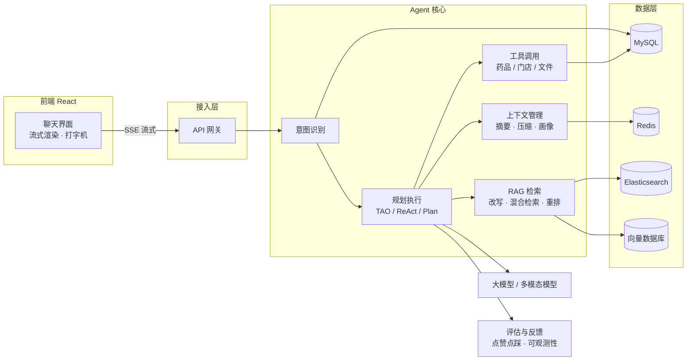
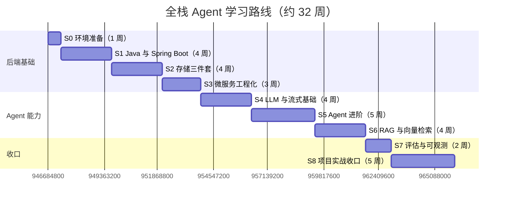

# AI 健康管家 · 全栈 Agent 工程师学习计划

> 依据 `health.md` 生成 · 起点：前端工程师（后端基础薄弱） · 终点：具备独立交付「AI 健康管家」的全栈 Agent 工程师能力
>
> 主线：**从点（单点技术）→ 线（完整链路）→ 面（产品级系统）**，所有学习内容都以「AI 健康管家」为落地载体。

---

## 一、起点与终点

### 1.1 现状盘点

| 维度 | 现状 | 说明 |
|---|---|---|
| 前端 | ✅ 已有优势 | React、流式渲染、打字机效果 —— 开发职责中的前端部分已具备，是全程最大的杠杆 |
| 后端 | ⚠️ 薄弱，重点补 | Java、微服务、MySQL、Redis、ES、向量数据库 |
| Agent 能力 | 🆕 从零建 | 意图识别、规划执行（Plan/RePlan/TAO/ReAct）、上下文管理、RAG、评估反馈 |
| 产品视角 | 🆕 待建立 | 健康数据沉淀、用户画像、用药推荐与下单转化 |

### 1.2 能力目标（点到面）

- **点**：把每个关键技术学成可动手的最小单元（如：能写出命中索引的 SQL、能手写一轮 ReAct 工具调用）。
- **线**：把点串成完整链路（如：意图识别 → 规划 → 检索 → 生成 → 反馈 的一条端到端请求链路）。
- **面**：以 AI 健康管家的六大功能为载具，让所有链路组合成可交付的产品系统。
- **检验标准**：不看教程，能从零把一条链路写出来、跑起来、讲清楚。

### 1.3 学习铁律（贯穿全程）

1. **项目驱动**：每学一个知识点，立刻在健康管家场景里落地，不做纯理论囤积。
2. **输出倒逼输入**：每周写一篇笔记/复盘（讲不清 = 没学会）。
3. **先跑通，再优化**：MVP 优先，性能、优雅、扩展性放在链路通畅之后。
4. **前端不丢**：流式渲染与交互体验要持续打磨到"作品级"，这是你区别于纯后端工程师的差异化优势。
5. **官方文档优先**：以官方文档为第一信息源，教程只用于入门。

---

## 二、技术栈全景（health.md 需求 → 选型 → 阶段）

| 项目需求（health.md） | 技术选型 | 学习阶段 |
|---|---|---|
| 前端：React、流式渲染、打字机效果 | React + SSE + 增量渲染 | S4 / S8 |
| 后端：Java | Java 17 + Spring Boot 3 | S1 |
| 微服务 | Spring Cloud Alibaba（Nacos / Gateway / OpenFeign / Sentinel） | S3 |
| MySQL | MySQL 8 + MyBatis-Plus | S2 |
| Redis | Redis 7（缓存 / 会话 / 锁 / 限流） | S2 |
| ES | Elasticsearch 8 + IK 分词 | S2 |
| 向量数据库 | Milvus / Qdrant / pgvector（三选一） | S6 |
| 异步解耦（报告解读、消息落库） | RocketMQ / Kafka | S3 |
| 意图识别 | 规则 + few-shot 分类 + 语义路由 | S5 |
| 规划执行 Plan / RePlan / TAO / ReAct | 自研 Agent 循环 + Spring AI / LangChain4j | S5 |
| 上下文管理：摘要 / 压缩 / 细节召回 / 用户画像 | 摘要链 + 向量召回 + 画像存储 | S5 |
| 智能检索 RAG + 缓存 | 混合检索 + Rerank + 语义缓存 | S6 |
| 可观测性与评估、点赞点踩 | 评测集 + Langfuse / OpenTelemetry + 反馈表 | S7 |
| 报告解读（多模态） | 图片 OCR + 多模态 LLM + 结构化输出 | S6 |

### 系统架构全景

---

## 三、时间轴（约 32 周，可按每周投入弹性伸缩）

> 建议投入：工作日每天 1~2 小时 + 周末半天（约 15~20 小时/周）。时间不足时按比例拉长周期，不要压缩实践环节。

| 阶段 | 周次 | 主题 | 核心产出 |
|---|---|---|---|
| S0 | 第 1 周 | 环境搭建与作战地图 | 可运行的开发环境 + 学习仓库 |
| S1 | 第 2–5 周 | Java 与 Spring Boot 后端基础 | 药品信息查询 REST API |
| S2 | 第 6–9 周 | 存储三件套：MySQL / Redis / ES | 会话语义体系 + 药品全文检索 |
| S3 | 第 10–12 周 | 微服务与工程化 | 多服务拆分 + 容器化一键启动 |
| S4 | 第 13–16 周 | LLM 与流式对话基础 | 流式聊天闭环（前端主场） |
| S5 | 第 17–21 周 | Agent 进阶：意图/规划/上下文 | 健康自检 Agent + 记忆系统 |
| S6 | 第 22–25 周 | RAG 与向量检索 | 药品知识库问答 + 报告解读 |
| S7 | 第 26–27 周 | 评估、反馈与可观测性 | 评测集 + 反馈闭环 |
| S8 | 第 28–32 周 | 项目实战收口 | AI 健康管家完整版 |

---

## 四、分阶段详细计划

### S0 · 第 1 周：环境搭建与作战地图

**目标**：打通工具链，建立学习仓库，画出自己对项目的能力地图。

**知识点**
- JDK 17 + IntelliJ IDEA + Maven 安装与配置
- Git 分支工作流（feature 分支 + 自审 PR）
- Docker Desktop 安装，跑起 MySQL / Redis 容器

**实践任务**
1. 新建 `health-agent-lab` 学习仓库，按 S1~S8 建立模块目录。
2. 跑通 Spring Boot Hello World，暴露 `GET /api/health` 接口。
3. 用 Docker 启动 MySQL、Redis，并成功连接。

**✅ 验收标准**
- 能用 curl 调通自己写的接口。
- 能解释 `pom.xml` 的基本结构与依赖管理流程。

---

### S1 · 第 2–5 周：Java 与 Spring Boot 后端基础

> 策略：**前端对照法** —— Java 对照 TypeScript，Spring 对照 Node/Express，降低陌生感。

**Week 2 — Java 语言速成**
- 基础语法：类型系统、字符串、数组、控制流（对照 TS 找差异，如值传递、== vs equals）
- 面向对象：类 / 接口 / 抽象类 / 继承 / 多态 / 封装
- 集合框架：`List` / `Map` / `Set`、`Stream API`、`Optional`
- 异常体系、泛型、注解、Lambda
- **实践**：用 Java 重写 10 个你熟悉的 TS 工具函数；刷 20 道基础算法题
- **验收**：能解释 `ArrayList` vs `LinkedList` 的取舍；能写出带泛型的工具类

**Week 3 — Spring Boot 与 Web 层**
- IoC / DI、Bean 作用域与生命周期、自动配置原理
- Spring MVC：`@RestController`、参数绑定、`@Valid` 校验
- RESTful 规范、统一返回体、全局异常处理、拦截器
- **实践**：完成药品信息查询 API（列表 / 详情 / 搜索）+ Swagger 文档
- **验收**：能说清「一个请求从进 Controller 到返回响应」的完整流程

**Week 4 — 持久层与 SQL 入门**
- JDBC 原理、连接池（HikariCP）、MyBatis / MyBatis-Plus
- **实践**：药品表 CRUD + 分页 + 多条件查询；手写 30 条 SQL 练习
- **验收**：能手写常见 SQL；能解释 ORM 与手写 SQL 的取舍

**Week 5 — 工程化与测试**
- Maven 多模块、Profile 配置、日志（SLF4J / Logback）
- JUnit 5 + Mockito 单元测试
- **实践**：药品服务单测覆盖率 60%+；接入 CI 自动跑测试
- **验收**：能独立排查「依赖冲突」；CI 全绿

---

### S2 · 第 6–9 周：存储三件套（MySQL / Redis / ES）

**Week 6–7 — MySQL**
- 建模：三范式、ER 设计 —— 为健康管家设计核心表：用户 / 药品 / 门店 / 会话 / 消息 / 健康档案 / 反馈
- 索引：B+ 树、联合索引、最左前缀、覆盖索引、`EXPLAIN` 分析
- 事务：ACID、四种隔离级别、MVCC、行锁 / 间隙锁
- 优化：慢 SQL 定位与改写、深分页优化
- **实践**：实现会话 / 消息表（支持历史对话、分页、按会话聚合）；用 10 万行数据做索引对比实验
- **验收**：给你一条慢 SQL，能独立完成 `EXPLAIN` 解读 + 优化方案

**Week 8 — Redis**
- 数据类型与场景：String（缓存/计数）、Hash（对象）、List（消息）、Set（去重）、ZSet（排行）
- 缓存模式：Cache Aside、TTL、穿透 / 击穿 / 雪崩
- 分布式锁（SETNX + Lua）、限流（滑动窗口）
- **实践**：常见问题题库缓存（支撑「换一批」）；会话上下文缓存；接口限流
- **验收**：能说清缓存一致性方案；能写一个安全的分布式锁

**Week 9 — Elasticsearch**
- 倒排索引原理、IK 分词器、Mapping 设计
- DSL：match / term / bool、聚合、高亮、拼音搜索
- 数据同步：双写 vs CDC（Canal）
- **实践**：药品全文检索（商品名 / 通用名 / 别名 / 拼音 / 容错）
- **验收**：能解释「为什么 ES 检索比 `LIKE %xx%` 快」；能设计药品检索方案

---

### S3 · 第 10–12 周：微服务与工程化

**知识点**
- 服务拆分原则：按业务域拆 —— 用户服务 / 药品服务 / 会话服务 / Agent 服务 / 文件服务
- Spring Cloud Alibaba：Nacos（注册 + 配置中心）、Gateway（网关）、OpenFeign（远程调用）、Sentinel（限流降级）
- Docker：Dockerfile 打镜像、Docker Compose 编排全套中间件
- 消息队列（RocketMQ / Kafka）：异步解耦 —— 报告解读任务、消息落库

**实践任务**
1. 把 S1 的药品服务 + 新拆的会话服务注册到 Nacos，经 Gateway 互调。
2. 编写 Dockerfile + Compose，一键启动 MySQL / Redis / ES / Nacos。
3. 用消息队列实现「报告解读耗时任务」的异步处理骨架。

**✅ 验收标准**
- 本地能同时起 3 个以上服务并完成跨服务链路调用。
- 能说清注册中心 / 网关 / 配置中心各自职责与协作关系。

---

### S4 · 第 13–16 周：LLM 与流式对话基础

**Week 13 — LLM 基础与 Prompt 工程**
- LLM 工作原理直觉：Transformer、Token、上下文窗口、温度 / Top-p
- API 调用：多轮消息结构、系统提示、结构化输出约束
- Prompt 工程：角色设定、少样本、思维链、格式约束
- **实践**：健康知识问答最小闭环（前端输入 → 后端调 LLM → 返回）
- **验收**：能写出稳定输出 JSON 的 Prompt；理解 Token 计费与上下文限制

**Week 14 — 流式渲染与聊天体验（前端主场，做深做透）**
- SSE 原理、`text/event-stream`、fetch + ReadableStream（与 EventSource / WebSocket 对比）
- 打字机效果：增量 Token 渲染、Markdown 流式解析、代码块 / 表格处理
- 体验细节：停止生成、重新生成、断线重连、自动滚底
- **实践**：封装 React 聊天组件（消息列表 + 流式渲染 + 打字机 + 状态管理）
- **验收**：能不依赖现成库，手写一个流式渲染 Hook

**Week 15 — Function Calling 与工具调用**
- 工具定义（JSON Schema）、调用 - 回填循环、并行工具调用
- **实践**：给问答 Agent 挂载「药品查询」「门店查询」工具，由模型自主决策调用
- **验收**：能画出一次完整工具调用的时序图

**Week 16 — Agent 框架（Spring AI / LangChain4j 二选一）**
- 核心抽象：ChatClient、Advisor、Tool、Memory
- 会话记忆 ChatMemory（窗口 / 摘要策略）
- **实践**：用框架重构最小闭环；接入会话记忆，实现多轮问答
- **验收**：能对比「手写循环」与「框架封装」的差异与适用场景

---

### S5 · 第 17–21 周：Agent 进阶（本项目核心能力）

**Week 17 — 意图识别**
- 输入规范化：清洗、纠错、口语化 / 方言 → 标准表述
- 意图分类演进：规则 → 小模型 → LLM few-shot，以及组合策略
- 多意图识别与拆解、低置信度兜底（澄清追问）
- **实践**：健康管家意图路由：查药 / 健康知识 / 健康自检 / 报告解读 / 闲聊 / 转人工
- **验收**：自建 100 条真实语料测试集，路由准确率 ≥ 90%

**Week 18 — 规划执行：TAO / ReAct / Plan-and-Execute / RePlan**
- ReAct：Thought → Action → Observation 循环与终止条件
- Plan-and-Execute：任务分解、步骤依赖、执行状态机
- TAO 与 ReAct 的关系；失败检测与 RePlan；步数 / 超时预算控制
- **实践**：健康自检 Agent —— 引导式收集（年龄 → 症状 → 程度 → 持续时间）→ 分析可能原因 → 给建议 → 推荐就近门店与药品
- **验收**：能画出状态机；Agent 信息不全时主动追问、跑偏时能拉回

**Week 19–20 — 上下文管理**
- 摘要：滚动摘要、分层摘要、摘要注入策略
- 压缩：Token 预算分配、历史裁剪、关键信息保留
- 细节召回：历史消息向量化，按需召回原始细节
- 用户画像：短期（会话状态）+ 长期（病史 / 偏好 / 用药史）的抽取、存储、更新、注入
- 长对话任务管理：多会话隔离、任务状态持久化、跨会话记忆
- **实践**：实现「长对话不丢信息」的记忆系统 —— 摘要在前、细节可召、画像持续更新
- **验收**：用 30 轮以上对话脚本验证关键信息不丢失

**Week 21 — 综合演练：「猜你想找」**
- 症状描述 + 健康数据 → 用户画像 → 门店 / 药品推荐 → 下单引导
- **实践**：打通 画像 → 检索 → 推荐 → 前端卡片流 全链路
- **验收**：推荐结果能给出可解释的理由

---

### S6 · 第 22–25 周：RAG 与向量检索

**Week 22 — RAG 基础**
- 文档处理：PDF / 图片解析、OCR、清洗、分块策略（固定 / 重叠 / 语义 / 父子块）
- Embedding：模型选型、维度、相似度度量（余弦 / 内积）
- **实践**：药品说明书 + 健康知识库 → 切片入库
- **验收**：能解释「为什么需要分块」及 Chunk 大小的权衡

**Week 23 — 向量数据库**
- 选型对比：Milvus / Qdrant / pgvector（定一个深入）
- 索引：HNSW / IVF，召回率与性能权衡
- 混合检索：向量 + 全文（ES）+ 结构化过滤（药品类别 / 适用人群）
- **实践**：药品语义检索 —— 自然语言症状描述 → 候选药品
- **验收**：能说清 ANN 检索原理与关键参数含义

**Week 24 — RAG 优化与缓存**
- 召回优化：查询改写（多查询 / HyDE）、Rerank 重排、上下文压缩
- 引用溯源：答案带出处（医疗场景必须）
- 缓存：语义缓存（相似问题命中）、热点问题缓存
- **实践**：做一组 A/B 实验 —— 优化前后召回率 / 答案忠实度量化对比
- **验收**：能用数据给出优化结论，而非「感觉变好了」

**Week 25 — 报告解读（多模态）**
- 文件链路：图片 / 文件上传、对象存储、大文件处理（前端经验迁移）
- 多模态理解：报告图片 → 结构化输出（异常指标 / 临床意义 / 健康风险 / 就医建议 / 用药优化 / 生活方式建议）
- **实践**：完成报告解读全链路，前端输出结构化卡片
- **验收**：结构化输出稳定（JSON Schema 校验通过率达标）

---

### S7 · 第 26–27 周：评估、反馈与可观测性

**知识点**
- 评估体系：评测集构建 —— 意图识别准确率、RAG 召回率 / 忠实度、任务完成率
- 用户反馈：点赞 / 点踩 → 原因收集 → 标注 → 回流到 Prompt 与检索优化
- 可观测性：全链路 Trace（网关 → Agent → 检索 → LLM → 工具）、Token 成本、P95 延迟、错误率
- Prompt 版本管理与 A/B 实验

**实践任务**
1. 建评测集并跑通自动化评估脚本。
2. 实现点赞 / 点踩埋点 + 观测面板 + 反馈回流闭环。

**✅ 验收标准**
- 能回答：「这次改动让系统变好了吗？怎么证明？」

---

### S8 · 第 28–32 周：项目实战收口（六大核心功能）

| 周次 | 任务 | 对应功能（health.md） |
|---|---|---|
| 第 28 周 | 历史对话管理 + 新会话 + 常见问题（换一批） | 功能 1 / 2 / 3 |
| 第 29 周 | 健康自检全流程打磨（异常兜底、边界用例） | 功能 5 |
| 第 30 周 | 猜你想找：推荐 + 可解释性 + 下单引导 | 功能 4 |
| 第 31 周 | 报告解读全链路 + 医疗合规（免责声明、敏感信息处理） | 功能 6 |
| 第 32 周 | 端到端联调、压测、复盘文档、演示 | 全项目 |

**✅ 最终验收**
- [ ] 六大功能全部可演示
- [ ] 流式输出在低配网络下依然流畅（前端体验达标）
- [ ] 长对话 30 轮以上不丢关键信息
- [ ] 有压测报告、评测报告、技术复盘文档
- [ ] 能画出并讲清系统架构与每条核心链路

---

## 五、六大核心功能 → 能力映射

| 功能（health.md） | 后端能力 | Agent 能力 | 前端能力 | 阶段 |
|---|---|---|---|---|
| 1. 历史对话管理 | MySQL 表设计、分页 | 会话记忆持久化 | 列表 / 滚动加载 | S1 / S2 / S5 |
| 2. 常见问题（换一批） | Redis 缓存、题库接口 | 问题生成策略 | 点击交互、换批动画 | S2 / S4 |
| 3. 开启新会话 | 会话管理、状态隔离 | Memory 隔离机制 | 会话切换、状态重置 | S2 / S4 |
| 4. 猜你想找 | 门店 / 药品服务 | 用户画像 + 推荐 + 可解释性 | 卡片流、下单引导 | S5 / S6 |
| 5. 健康自检 | 会话状态机、档案落库 | 引导式对话 + 规划执行 | 步骤式交互、进度反馈 | S5 |
| 6. 报告解读 | 文件服务、异步任务 | 多模态 + 结构化输出 | 上传 / 预览、结果卡片 | S3 / S6 |

---

## 六、每周节奏与学习方法

### 6.1 时间分配建议

| 时段 | 内容 | 说明 |
|---|---|---|
| 工作日 × 1h | 知识点学习 + 小练习 | 通勤可听理论，坐下就写代码 |
| 工作日 × 0.5h | 复习 + 笔记 | 整理当日要点，落到学习仓库 |
| 周末 × 半天 | 集中实践 | 完成本周实践任务与验收 |
| 每周日晚 | 周复盘 | 学了什么 / 做了什么 / 卡在哪 / 下周计划 |

### 6.2 学习方法

1. **3:1 实践比**：每学 3 小时理论，至少 1 小时动手。
2. **费曼技巧**：每周把学的东西讲给别人听，或写成博客 —— 讲不清 = 没学会。
3. **对照学习**：前端经验是最好的脚手架（TS→Java、Express→Spring、前端数据流→后端链路）。
4. **刻意练习**：薄弱点单点攻坚（手写 SQL、手写流式渲染、手写 ReAct 循环）。
5. **复盘模板**：学了什么 → 做了什么 → 卡在哪 → 下周怎么办。

---

## 七、阶段里程碑自测清单

| 阶段 | 自测问题（能流畅回答 + 动手写出 = 过关） |
|---|---|
| S1 | 能独立写出带校验、统一返回、全局异常的 REST API 吗？ |
| S2 | 给你一张大表和一条慢查询，能定位并优化吗？能设计健康管家的库表吗？ |
| S3 | 能说清一次跨服务调用的完整链路吗？能容器化一键启动全套环境吗？ |
| S4 | 能手写一个不依赖三方库的 SSE 流式聊天闭环吗？ |
| S5 | 30 轮对话后 Agent 还记得用户的核心信息吗？健康自检状态机画得出来吗？ |
| S6 | 能把检索召回率提升并量化证明吗？报告解读能稳定输出结构化结果吗？ |
| S7 | 能回答「版本 v1.2 比 v1.1 好多少，为什么」吗？ |
| S8 | 六大功能全部可演示吗？每条核心链路都能讲清楚吗？ |

---

## 八、风险与应对

| 风险 | 应对策略 |
|---|---|
| 后端薄弱，起步慢 | 用前端对照法降低门槛；每个知识点立刻写代码；允许 S1 阶段适当超时 |
| 工作忙，学习断档 | 锁定每天 1 小时固定时段；时间不足时只做「复习 / 笔记」微任务，保持不断线 |
| 只学不用，学完就忘 | 所有练习必须落在 `health-agent-lab` 与健康管家场景中 |
| 贪多求全，追新框架 | 严格按本计划主线走；框架（Spring AI / LangChain4j、向量库）各只选一个深入 |
| 完美主义，卡在细节 | 先跑通再优化；用验收标准代替「感觉」判断完成度 |
| 闭门造车 | 每周输出笔记；参与社区交流；定期找人 review 架构设计 |

---

## 附：与 health.md 项目视角的对应关系

| 项目整体视角（health.md） | 覆盖阶段 |
|---|---|
| 意图识别：用户输入规范化、识别真实用药需求 | S5 Week 17 |
| 规划执行：Plan、RePlan、TAO、ReAct | S5 Week 18 |
| 上下文管理：摘要、压缩、细节召回、短期/长期画像、长对话任务管理 | S5 Week 19–21 |
| 智能检索：RAG 提升召回率、缓存 | S6 |
| Agent 评估与反馈：可观测性、点赞点踩 | S7 |
| 产品意义：沉淀健康数据、构建画像、推荐用药引导转化 | S2（数据建模）+ S5（画像/推荐）+ S8（转化链路） |
| 开发职责：前端流式渲染 / 打字机 + 后端 Java 微服务全家桶 | 全程（前端 S4 深化，后端 S1–S3 补齐） |
